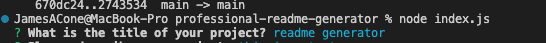
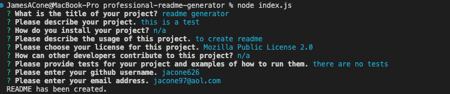
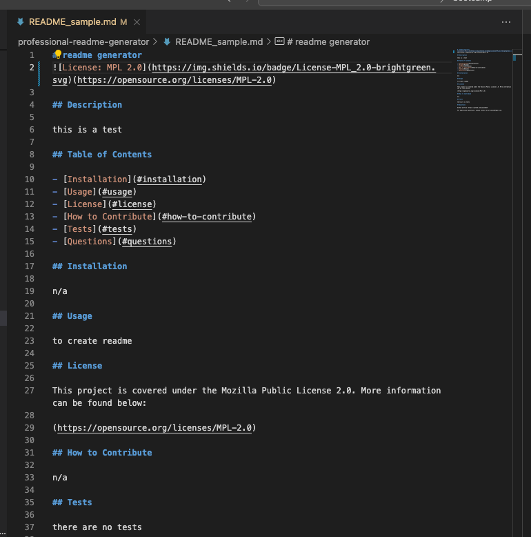

# Professional-README-Generator
An app that creates a README

## Description
This application is a simple README generator that is run out of the terminal. It prompts the user with several questions for each section of the README and then generates a README_sample.md file within that project. 

## Installation
Ensure that you have node installed. Then, just clone the repository into VSCode or some other coding application. 

## Usage
A user must clone the repository and navigate to the correct folder within the terminal. Once in the correct folder, type in "node index.js". The user will then be prompted with the first question, which is to enter the title of the project.

Once you enter your response, press enter and the next question will come up. After the final question, which asks for your email, the terminal will log "README has been created".

Within the project, a new file with your generated readme will be creadted. This file is titled "README_sample.md" and will look like the below picture.

Below is a link to a walkthrough video:

## Credits
https://gist.github.com/lukas-h/2a5d00690736b4c3a7ba

## License
Please refer to the license in the repo.